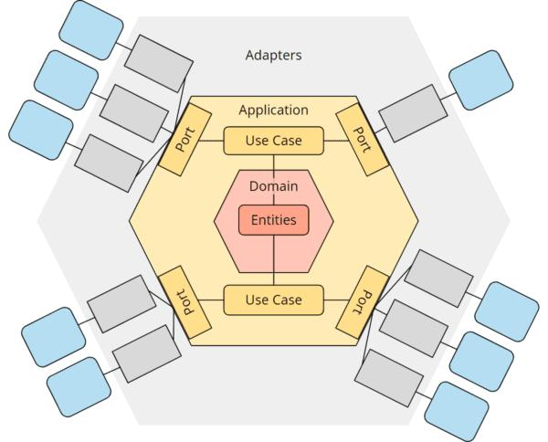

# lct-simulator112

Учебный симулятор подготовки диспетчеров экстренных служб города по вызовам от системы 112. Проект сделан в рамках Хакатона ЛЦТ 2026

Действующий проект: https://sim-112.online <br>
Документация по тестированию функциональности системы: [reviewer-test-scenario.md](docs/reviewer-test-scenario.md). Рекомендуем следовать ей при ручном тестировании.

## Архитектура


## Стек технологий

### Бэкенд
*   **Java 21**
*   **Spring Boot**
*   **gRPC**
*   **Apache Kafka** (асинхронное взаимодействие)
*   **PostgreSQL** + **Flyway** (основное хранилище данных, миграции)
*   **Redis** (rate limit в gateway, состояние context-service)
*   **MinIO** (материалы курсов, записи звонков, бэкапы)
*   **Docker**

### Фронтенд
*   **Astro (SSR)**
*   **Preact**
*   **Web Awesome**
*   **Leaflet**

### Голосовой диалог и LLM (dialog-service)
*   **Python 3.12**
*   **FastAPI**
*   **Vosk** (распознавание речи)
*   **F5-TTS** (синтез речи)
*   **LLM** - qwen3:4b-instruct-2507-q4_K_M
*   **Ollama**: AI-генерация черновиков происшествий в конструкторе (incident-service)

### Тестирование
*   **pytest** (dialog-service)
*   **SpringBootTest**
*   **node:test**

### Инфраструктура
*   **Docker Compose**
*   **GitHub Actions**
*   **Prometheus**, **Grafana**, **Loki**
*   **nginx**

### Внешние API

*   **OpenStreetMap (Nominatim)** (поиск адресов и обратное геокодирование)
*   **2ГИС (MapGL API)** (отображение карт)
*   **DaData API** (подсказки и структурированные данные адресов)

## Архитектура и сервисы

Система состоит из микросервисов, взаимодействующих через API Gateway, gRPC и шину событий Kafka

### Гексагональная архитектура



Все сервисы с бизнес-логикой (auth, profile, incident, classifier, context, review, course, notification, admin и dialog-service на Python) построены по гексагональной архитектуре и делятся на три слоя:

*   **domain** — сущности и правила предметной области, без зависимостей от Spring, JPA, gRPC и FastAPI;
*   **application** — сценарии использования (use case) и порты: входные (что сервис умеет) и выходные (что ему нужно от внешнего мира);
*   **adapter** — реализации портов: REST, gRPC, WebSocket, Kafka, планировщики, база данных, клиенты других сервисов.

**Почему мы решили использовать именно её?** В симуляторе два похожих, но разных режима: оператор 112 (`SYSTEM_112`: звонки заявителей, заполнение карточек) и оператор ДДС (`DDS`: этапы реагирования с таймерами, звонки бригадам, переходы success/failure). Общее у них — прохождение уровня, проверка, оценка, сертификаты. Различается сценарий и правила. Гексагональная архитектура позволяет:

*   держать правила каждого режима в своём пакете домена (`domain/system112`, `domain/dds`) и не смешивать их с общим кодом;
*   переиспользовать общие сценарии и порты (создание прохождения, отправка на проверку, оценка по рубрикам) для обоих режимов;
*   добавить новый режим или изменить правила одного, не затрагивая REST, gRPC, хранилище и второй режим;

### Frontend
| Сервис | Порт | Назначение |
|---|---|---|
| [frontend](frontend) | 80 (в докере) / 4321 (dev) | Интерфейс студента, преподавателя и администратора |

### Микросервисы
| Сервис | HTTP | gRPC | Назначение |
|---|---|---|---|
| [api-gateway](backend/api-gateway) | 8080 | — | Единая точка входа, JWT, роли, rate limit |
| [auth-service](backend/auth-service) | 8081 | — | Регистрация, вход, refresh-токены, роли |
| [profile-service](backend/profile-service) | 8082 | 9094 | Профили пользователей |
| [context-service](backend/context-service) | 8084 | 9090 | Состояние прохождения уровня |
| [review-service](backend/review-service) | 8085 | 9092 | Проверка и оценка прохождений |
| [incident-service](backend/incident-service) | 8086 | 9091 | Уровни и происшествия, AI-генерация сценария |
| [classifier-service](backend/classifier-service) | 8087 | 9093 | Классификатор происшествий и маршрутизация служб |
| [notification-service](backend/notification-service) | 8090 | — | Уведомления и письма |
| [course-service](backend/course-service) | 8088 | 9095 | Курсы, учебные группы, сертификаты |
| [admin-service](backend/admin-service) | 8089 | — | Мониторинг, аудит, бэкапы, управление сервисами |
| [dialog-service](backend/dialog-service) | 8005 | — | Голосовой диалог: STT → LLM → TTS (Python) |
| [shared](backend/shared) | — | — | Общие protobuf-контракты и несколько value objects |
| [prod](prod) | — | — | docker-compose, nginx, мониторинг |
### Kafka Topics

*   **user.created** (`auth-service` → `notification-service`): регистрация пользователя
*   **email.verification.requested** (`auth-service` → `notification-service`): подтверждение email
*   **password.reset.requested** (`auth-service` → `notification-service`): сброс пароля
*   **review.comment.created** (`review-service` → `notification-service`): новый комментарий к проверке
*   **certificate.issued** (`course-service` → `notification-service`): выдан сертификат
*   **audit.http.requests** (`api-gateway` → `admin-service`): аудит HTTP-запросов
*   **audit.domain.events** (`auth-service` → `admin-service`): аудит доменных событий

## Хранилища данных

У каждого сервиса своя база в общем PostgreSQL (список баз в [init-db.sql](init-db.sql)), внешних ключей между базами нет:
*   `auth` — пользователи и токены
*   `profile` — профили
*   `incident` — уровни и происшествия
*   `context` — состояние прохождений
*   `review` — оценки и проверки
*   `notification` — уведомления
*   `classifier` — справочник происшествий
*   `course` — курсы, группы, сертификаты
*   `admin` — аудит и настройки

**Redis** используется gateway для rate limit и context-service. <br>
**MinIO**: бакеты `course-materials`, `backups`, `call-recordings`.

## Маршруты
Актуальный список маршрутов: [application.yaml](backend/api-gateway/src/main/resources/application.yaml).

## Локальный запуск

Нужен Docker с Compose v2 (стек из ~20 контейнеров, с запасом по RAM).

Инструкция рассчитана на Linux (запуск стека и моделей локально проверялся на Ubuntu). На Windows рекомендуется WSL2: команды ниже выполняйте внутри него, Docker Desktop подключается к WSL2 через настройки интеграции. macOS не проверялся, часть команд (в частности скрипты F5-TTS) может не работать.
**В случае появиления трудностей** - можете протестировать на работающем проде:  https://sim-112.online  вместе с логинами и паролями, оставленными в заявке. Или можете отправить вашу проблему на почту: rahmedov17@mail.ru 

### 1. Приложение

```bash
cp .env.example .env      # изменить пустые значения
docker compose up --build
```

Первая сборка долгая (Maven для 10 Java-сервисов, PyTorch для dialog-service). Приложение: http://localhost:4321

Содержимое [.env.example](.env.example):

```dotenv
COMPOSE_PROJECT_NAME=sim112-local
DB_PASSWORD=postgres
FRONTEND_BASE_URL=http://localhost:4321
APP_BASE_URL=http://localhost:4321


MAIL_USERNAME=
MAIL_PASSWORD=

TTS_SERVER_TAILSCALE_HOST=host.docker.internal
OLLAMA_SERVER_TAILSCALE_HOST=host.docker.internal

LLM_BASE_URL=http://host.docker.internal:11434/v1
LLM_API_KEY=ollama
LLM_MODEL=qwen3-dialog:4b

MLSERVER_URL=http://host.docker.internal:8080
MLSERVER_MODEL_NAME=review-model

S3_ACCESS_KEY=minioadmin
S3_SECRET_KEY=minioadmin

DGIS_MAPGL_KEY=
PUBLIC_DADATA_API_KEY=

CORS_ALLOWED_ORIGINS=*
RATE_LIMIT_REPLENISH=200
RATE_LIMIT_BURST=400
```

Без `MAIL_*` письма не отправляются, а войти можно только с подтверждённым email. Первый подтверждённый пользователь получает роль ADMIN, остальные — STUDENT. Чтобы подтвердить аккаунт без почты, зарегистрируйтесь в интерфейсе, затем возьмите токен из базы и откройте ссылку:

```bash
TOKEN=$(docker compose exec -T postgres psql -U postgres -d auth -Atc \
  "select token from email_verification_tokens order by created_at desc limit 1")
echo "http://localhost:4321/verify-email?token=$TOKEN"
```

Сброс пароля без почты работать не будет. Без `PUBLIC_DADATA_API_KEY` не работают подсказки адресов, без `DGIS_MAPGL_KEY` — карта 2GIS.

Полезные команды:

```bash
docker compose ps
docker compose logs -f dialog-service
docker compose down        # остановить; добавить -v, чтобы удалить БД, MinIO и JWT-ключи
```

### 2. ИИ-модели

Модели запускаются на хосте (не в Docker) и доступны контейнерам через `host.docker.internal`. Без них стек поднимется, но не будут работать голосовой диалог, проверка диалогов и AI-генерация происшествий.

CUDA обязательна только для TensorRT-режима F5-TTS (см. 2.2). Ollama и модель проверки диалогов работают и на CPU, F5-TTS в режиме `pytorch` при отсутствии CUDA тоже переключается на CPU, но синтез речи на CPU будет намного медленнее.

#### 2.1 Проверка диалогов (review-service), порт 8080

Репозиторий: https://github.com/rahmedovdamir/review-model-server

Нужен Python 3.11 или 3.12 (проверено на 3.11). На Python 3.14 `mlserver` 1.3.5 не стартует без ручного патча своего кода.

```bash
git clone https://github.com/rahmedovdamir/review-model-server
cd review-model-server
python3.11 -m venv .venv && source .venv/bin/activate
pip install -r requirements.txt
mlserver start .
```

#### 2.2 Синтез речи F5-TTS, порт 8888

Репозиторий: https://github.com/rahmedovdamir/F5_tts_server

Сервер можно клонировать в любую папку. Пути задаются в `config.sh` и переопределяются переменными окружения: `F5TTS_PYTHON_BIN` (по умолчанию `~/f5tts-venv/bin/python`), `F5TTS_LOG_FILE`, `F5TTS_PID_FILE`, `F5TTS_PORT` (по умолчанию `8888`).

Бэкенд синтеза выбирается автоматически (переменная `F5_TTS_BACKEND`):
- `pytorch` — работает без TensorRT (на GPU быстро, на CPU медленно), модель `Misha24-10/F5-TTS_RUSSIAN` скачивается с Hugging Face при первом старте. Выбирается, если TensorRT-окружения нет;
- `trt` — быстрый TensorRT-LLM, выбирается, если существует `F5_TRT_PYTHON`. Нужны отдельное окружение Python 3.10 с TensorRT-LLM и репозиторий `F5_FASTER_ROOT` с движками под конкретную видеокарту, поэтому на чужой машине этот режим не воспроизводится.

Нужны системные `ffmpeg` и `libmagic1` (Ubuntu/Debian: `sudo apt install ffmpeg libmagic1`, macOS: `brew install ffmpeg libmagic`). Виртуальное окружение по умолчанию ищется в `~/f5tts-venv` (другое — через `F5TTS_PYTHON_BIN`).

```bash
git clone https://github.com/rahmedovdamir/F5_tts_server
cd F5_tts_server
python3.11 -m venv ~/f5tts-venv
~/f5tts-venv/bin/pip install -r requirements.txt
./stop_server.sh && ./start_server.sh
tail -f ~/f5tts-server-v2.log
```

#### 2.3 LLM (Ollama), порт 11434

Используется в dialog-service, review-service (`LLM_*`) и incident-service (генерация происшествий).

```bash
ollama pull qwen3:4b-instruct-2507-q4_K_M

cat > ~/Modelfile << 'EOF'
FROM qwen3:4b-instruct-2507-q4_K_M
PARAMETER num_ctx 8192
EOF
ollama create qwen3-dialog:4b -f ~/Modelfile

env OLLAMA_HOST=0.0.0.0:11434 OLLAMA_KEEP_ALIVE=-1 nohup ollama serve > ~/ollama-serve.log 2>&1 & disown
tail -f ~/ollama-serve.log
```

`OLLAMA_HOST=0.0.0.0` нужен, чтобы Ollama принимала соединения из контейнеров. Если Ollama уже запущена как systemd-сервис, остановите её (`sudo systemctl stop ollama`), иначе порт 11434 будет занят.

Проверка:
http://localhost:4321
```bash
curl http://localhost:11434/api/tags          # Ollama
curl http://localhost:8888/base_tts/         # F5-TTS
curl http://localhost:8080/v2/health/ready    # MLServer
```

Если модели запущены на другой машине, укажите её адрес в `TTS_SERVER_TAILSCALE_HOST`, `OLLAMA_SERVER_TAILSCALE_HOST`, `LLM_BASE_URL` и `MLSERVER_URL`.
